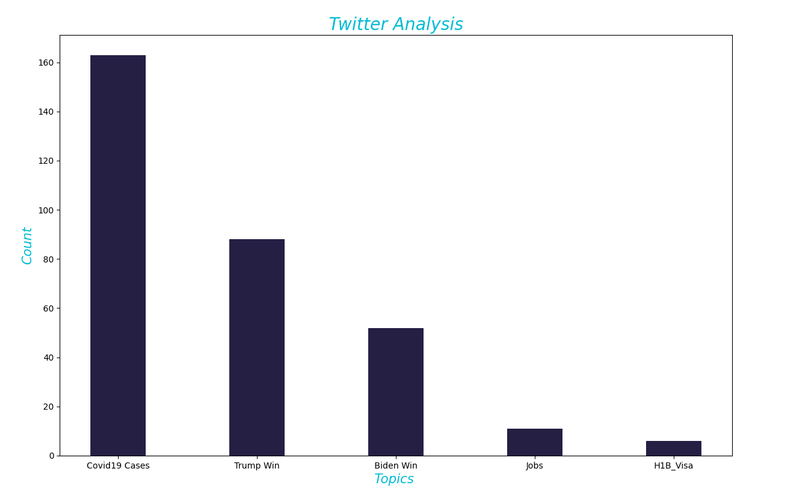

# Twitter-Trend-Analysis  

 
<h1This Project is for Research on Particular Hashtag and Finding a Useful Insight/> 

<b>What is Twitter ?</b>
 
Twitter is a 'microblogging' system that allows you to send and receive short posts called tweets. Tweets can be up to 140 characters long and can include links to relevant websites and resources.

Twitter users follow other users. If you follow someone you can see their tweets in your twitter 'timeline'. You can choose to follow people and organisations with similar academic and personal interests to you.

<b>Why use Twitter?</b>

Twitter has become increasingly popular with academics as well as students, policymakers, politicians and the general public.  Twitter is  now become the social media platform of choice for many.

<b> Why Analysis?</b>

  Data analysis is important in business to understand problems facing an organisation, and to explore data in meaningful ways. Data in itself is merely facts and figures. Data analysis organises, interprets, structures and presents the data into useful information that provides context for the data. This context can then be used by decision-makers to take action with the aim of enhancing productivity and business gain.
 

 <b>ABOUT</b>
 
 

  This is a simple Project in which about 15 Thousands Tweets are Extracted with the help of Tweepy Library in Python ,Those Extracted tweets are saved in a Csv File .
  

  

  Then Density of Specific Words are Counted from 15000 Rows of data ,specific words like "Trump will Win","Biden Will win" etc as users tweet about their choices so it can be blueprint of what are they thinking and whom side they are and what they need ,what are their Requirements ,what are the issues for the Elections etc.
  
  Obtained data is Plotted on a Bar Grap with the help of python which can be seen Below!
  

   
  
  

  <b>Analysis</b>
  

  <ul>
    <li>
      It can Be Seen From The Graph that Main Focus of the People Are on RISING COVID CASES!.</li>
    <li> Many are  Saying that Trmp Will Win</li>
    <li> MAny are Saying Biden Will Win</li>
    <li>Jobs is  also one of the Trending Topics</li>
    <li>H1b Visa is also of the issues</li>
    <li>The Analysis is done Just on the basis tweets ,It's Very Uncertain as their are many other factors and other credible sources of data is needed for actual Predictions ,But in the Ocean OF analysis It can be Like a Small Island! :)
    </ul>   
    <b>Disclaimer</b>
    
      The Above Data Extracted is Only For Educational Purpose and To See the Trends in Tweets as A Part Of a Educational Projects,It's Not Related to Any Actual Results or  To Hurt Anyone's Feelings or Emotions 
      The Graph PLotted is on the Basis of Tweets Extracted and Counted it has Nothing related to any media agency or any gov ,its just what people are tweeting.
      If anyone Needs The Data it's available but its encrypted for Password Contact me on (rajatagarwal1709@gmail.com) or contact me on Linkedin .
      
    
<b> PR (Pull Requests)are Welcome For Any Modifications Or Changes </b>
    
    
    
    
  
  
  
